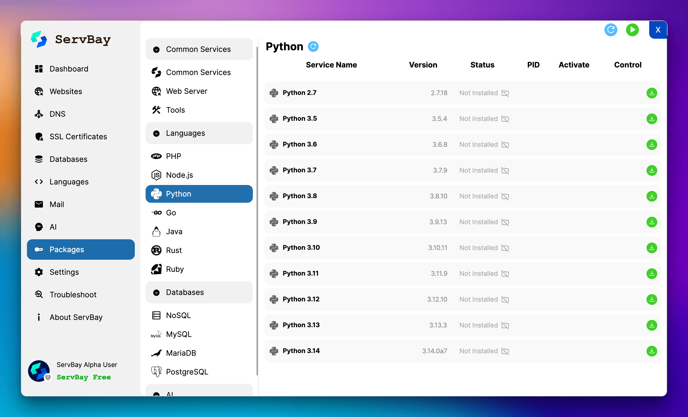
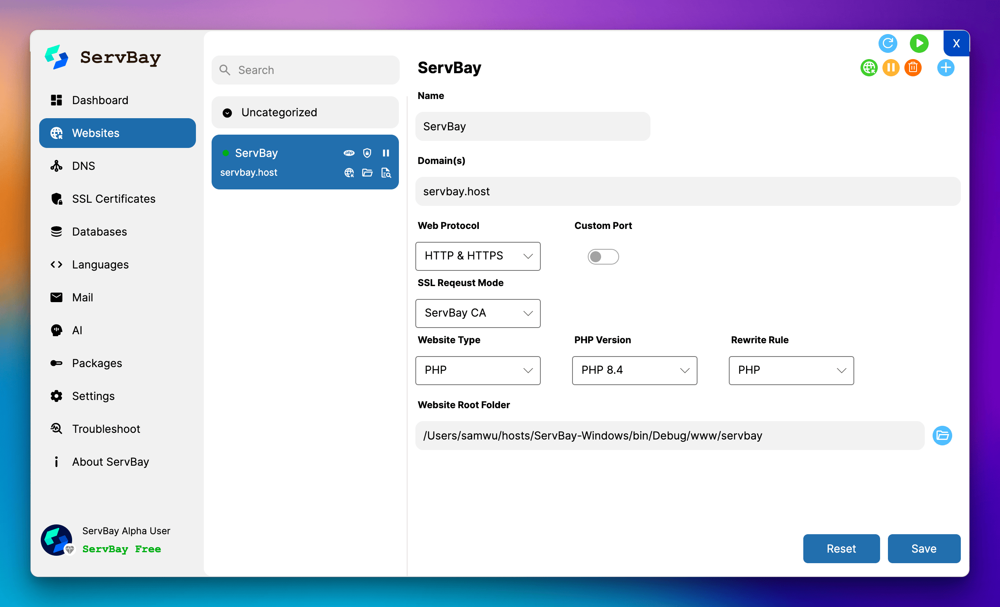

# ServBay Windows版リリース

[English](/README.md) | [简体中文](/README_zh-CN.md) | [繁體中文](/README_zh-TW.md) | [Español](/README_es.md) | [العربية](/README_ar.md) | [Português](/README_pt.md) | [Русский](/README_ru.md) | [日本語](/README_ja.md) | [Deutsch](/README_de.md) | [Français](/README_fr.md) | [Tiếng Việt](/README_vi.md) | [Türkçe](/README_tr.md) | [Italiano](/README_it.md) | [हिन्दी](/README_hi.md) | [Bahasa Indonesia](/README_id.md) | [Bahasa Melayu](/README_ms.md) | [Polski](/README_pl.md) | [Nederlands](/README_nl.md) | [Українська](/README_uk.md) | [ไทย](/README_th.md) | [한국어](/README_ko.md)

ServBay Windows版の公式リリースリポジトリへようこそ。本リポジトリでは、ServBayのWindows版公式リリースパッケージおよび変更履歴を公開しています。

## 🚀 ServBay：開発者のための究極ローカル開発プラットフォーム

ServBayは、**ワンストップ・高性能・使いやすさ**を追求した、開発者向けのローカルWeb開発環境統合ソリューションです。煩雑な環境構築作業を一掃し、数分でパワフルかつ柔軟にカスタマイズ可能な開発環境を構築できるので、開発やイノベーションに集中できます。

ServBayは単なるツールの集合体ではなく、**比類のない開発体験と圧倒的な機能性**を提供する**完全なエコシステム**です。Web開発者、バックエンドエンジニア、データサイエンティスト、AIアプリケーション開発まで、多様なニーズに応えます。

本リポジトリはServBayの**Windows版配布専用**です。

## ✨ ServBayの主な特長と強力な機能

ServBayは、開発者の生産性を高めるさまざまなツール群と強力な機能を搭載しています：

*   **多言語対応＆バージョン切替も簡単**:
    *   **PHP**：PHP 5.6～最新PHP 8.xまで複数バージョン対応、ワンクリックで切替ができ、プロジェクトごとの要件にも柔軟に対応。
    *   **Node.js**：Node.js 12～24まで複数バージョンを内蔵、依存関係の管理も容易です。
    *   **Python**：Python 2.7および3.5～3.14+に完全対応。Web開発、データサイエンス、機械学習プロジェクトにも最適。
    *   **Java**：OpenJDK 7～24まで複数バージョンを統合、さらにApache Mavenにも対応し、Javaプロジェクトの構築や管理が簡単。
    *   **Go (Golang)**：Go 1.11～1.24+サポート。高性能アプリ開発用のGoツールチェーンを一式提供。
    *   **Ruby**：Ruby 2.4～3.4をサポートし、特にRuby on Railsなどの開発に最適。
    *   **.NET**：.NET SDK 2.0～10.0（Windows版）に幅広く対応し、様々な.NET（Core/5+）プロジェクトの構築・実行要求に対応。
    *   **Rust**：高性能かつ安全性の高いRust言語を統合し、手軽にローカル開発やテストが可能。
*   **強力なデータベース機能＆マルチインスタンス対応**:
    *   **リレーショナルデータベース**：MySQL、MariaDB、PostgreSQLを標準搭載し、複数バージョンを同時に実行可能。
    *   **NoSQLデータベース**：Redis、Memcached、MongoDBなど主要なNoSQLデータベースを内蔵、インストール後すぐ利用可能。
    *   **データベース管理ツール**：phpMyAdminやAdminerを内蔵し、データベース管理も簡単。
*   **高性能Webサーバー＆柔軟な設定機能**:
    *   Caddy、Nginx、Apache等の主要Webサーバーに対応し、ビジュアル設定画面を提供。
*   **強力なローカルPKI機能：内蔵ServBay CA**:
    *   ServBayは、**ServBay CA**と呼ばれる完全な証明書認証局（CA）の仕組みを備えており、**ServBay User CA**（ユーザー定義のルート証明書用）と**ServBay Public CA**（公的信頼証明書発行用プリCA）から構成されています。
    *   すべてのローカル開発環境・サービスで利用するSSL証明書を、ユーザー自身が簡単にルートCA・中間CAを作成・管理し、独自の証明書発行が可能です。真のローカルHTTPS開発を実現し、ブラウザの警告も完全排除できます。
    *   証明書の発行・失効・インポート・エクスポートなど総合的な証明書管理機能を提供。
*   **AI・大規模言語モデル(LLM)サポート**:
    *   **Ollama連携**：ワンクリックでOllamaサービスをインストール＆管理し、DeepSeek・Llama 3・Qwenなど多彩なOSS大規模言語モデルをローカルで簡単に実行・デバッグ可能。
    *   ローカルAIアプリ開発や連携を強力にサポート。
*   **開発者に嬉しい便利機能**:
    *   **グラフィカルな管理画面**：シンプルで分かりやすいUIで、すべてのサービス・設定を手軽に管理。
    *   **ワンクリックでサービス起動/停止**：開発環境全体の状態を素早くコントロール。
    *   **公開SSL証明書取得**：**ACMEプロトコル**により、Let's Encrypt・ZeroSSL・Google Trust Servicesなどから無料の公開SSL証明書を取得して、デモやテスト用途にも便利。
    *   **カスタムドメイン管理**：ローカル開発用ドメインの管理も簡単。
    *   **コマンドライン対応**：`php`、`node`、`python`、`go`、`java`、`mysql`など、各種コマンドがターミナルから直に利用可能なCLIツール群を搭載。
    *   **マルチサイト管理**：複数のWebサイトプロジェクトを手軽に構成・管理でき、プロジェクト単位のランタイム環境設定もサポート。
    *   **リバースプロキシ対応**：ローカル上で稼働中のアプリ（Dockerや他のNode.jsサービス等）へのドメインアクセスも簡単。
    *   **ログ管理**：各サービスのログも分かりやすく一覧・管理可能。
    *   **クリーンなシステム・バックアップ**：グリーンインストール方式を採用しており、システム環境に変更を加えずに利用でき、バックアップ・移行・削除も容易。
    *   **自動起動**：OS起動時に自動起動設定もでき、常にサービスをスタンバイ可能。

*バージョンアップにより、一部機能は異なる場合があります。最新情報は公式ドキュメントをご参照ください。*

## 📥 ダウンロード方法

ServBay Windows版の全ての提供バージョンは、本リポジトリの**[リリースページ](../../releases)**で公開されています。

1.  [リリースページ](../../releases)にアクセスします。
2.  必要なバージョンを選択します（通常は最新の安定版リリースがおすすめです）。
3.  選択したリリースの「Assets」セクションから、該当するインストーラーパッケージ（例：`.exe`または`.zip`ファイル）をダウンロードします。
4.  ダウンロード後は、インストールガイドの指示に従って導入してください。

## 💬 問題報告・コミュニティサポート

皆さまからのフィードバックを大切にしています！ServBay for Windowsをご利用中に問題やご意見、ご要望・バグなどがございましたら、以下の方法でご連絡ください。

*   **このリポジトリでIssueを作成**：[ServBay-Windows-Release Issueページ](../../issues)に詳細をご記入の上投稿してください。
*   **メールでのご連絡**：[support@servbay.com](mailto:support@servbay.com)までメールをお送りください。
*   **コミュニティサポート**：公式コミュニティにもぜひご参加いただき、他の開発者と交流や情報共有、質問ができます。
    *   Discord: [https://talk.servbay.com/](https://talk.servbay.com/)
    *   Telegram: [https://telegram.servbay.dev/](https://telegram.servbay.dev/)
    *   WeChatグループ: [https://wechat-group.servbay.dev/](https://wechat-group.servbay.dev/)

Issueを投稿する際は、できるだけ詳細に「問題の内容」「再現手順」「ご利用中のOS環境」「ServBayのバージョン番号」等をお知らせください。迅速な問題特定と解決に役立ちます。

## 🔗 関連リンク

*   **ServBay公式サイト**：[https://www.servbay.com](https://www.servbay.com)
*   **ServBay macOS版ダウンロード・メインリポジトリ**：[https://github.com/ServBay/ServBay](https://github.com/ServBay/ServBay)
*   **ServBay公式ドキュメント・サポートセンター**：[https://support.servbay.com/](https://support.servbay.com/)

ServBayをご利用いただき、誠にありがとうございます。今後も最高・最強のローカル開発環境をお届けできるよう努めてまいります。